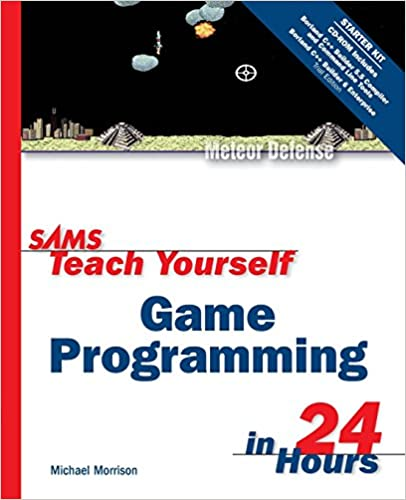
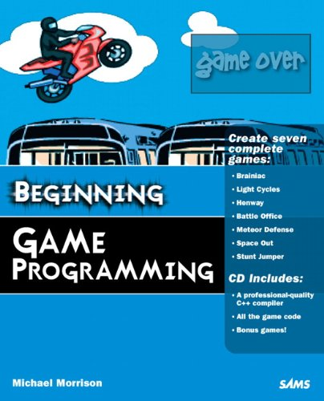

# Programming Windows© Games

### Background

Win9X/Me is officially dead!  Windows API ANSI encoding is dead!  Windows XP and later now use Unicode!

Windows and C/C++ have changed since 2003/2004.  Programmers need to adapt.

### Why this repository exists

I own a couple of OLD (© 2003 & 2004) books about creating 2D games using the Windows API.

 

I've spent a lot of time, years, updating and revising this pre-C++11 code to work with modern Windows and the newer C++ language standards.

The original source code and media files archived here are copyright © 2003 & 2004 by Samspublishing, the source files and resulting games are not my work.

##

### Notes

There may be links to websites or internet sources in these pages and source code. Links can go stale. A search engine is your friend.

### Musings on Windows© Games

To be honest parts of the game engine created are hard to convert to modern C++ practices.  More and more it is looking like the game engine needs to be rewritten top to bottom from scratch.  *UGH*
