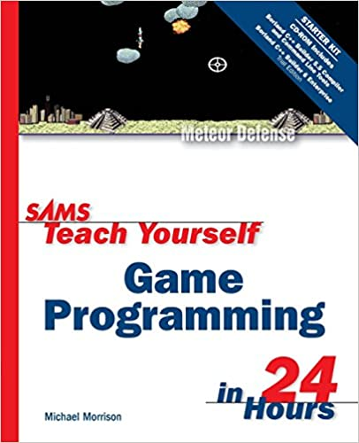
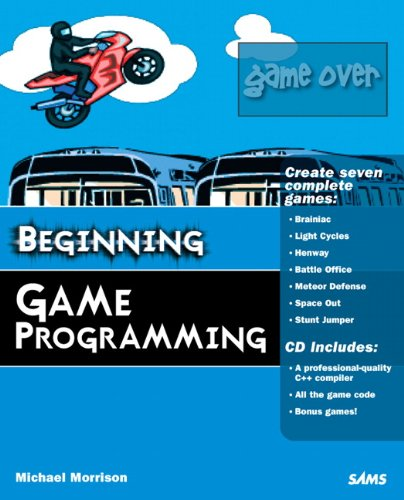

# Programming Windows Games

### Background
Win9X/Me is officially dead!  Windows API ANSI encoding is dead!  Windows XP and later now use Unicode!

Windows and C/C++ have changed since 2003/2004.  Programmers need to adapt.

### Why this repository exists
I own a couple of \*\****OLD***\*\* (© 2003 & 2004) books about creating 2D games using the Windows API.

 

I've spent a lot of time -- years -- updating and revising this pre-C++11 code to work with modern Windows and the newer C++ language standards.

Why did it take so long you might ask?  I was learning C++/WinAPI fundamentals as they changed over the years as well.  Yeah, I'm a slow and methodical learner.

The original (and modified) source code and media files are copyrighted © 2003 & 2004 by Samspublishing, the source files and resulting games are not my work.

There are no executables included, you need to create them by compiling the sources.  Learn to program by compiling, compiling, compiling.

There are 4 directories of original and revised game code sources.  The original game code from the two CDs, the WinAPI revisions dir, and two additional dirs for revised code using GDI+ and Direct2D.  Currently the GDI+ & D2D dirs are mostly empty placeholders.

### Compiler used
I've used Visual Studio 2015, 2017, 2019 and 2022 (Community) to update and test the game code.  Currently I am using VS 2022, setting the C++ language standard to C++20.

You should think about using VS 2022 as well.  It's free for the Community edition.

[Visual Studio 2022 Community download](https://visualstudio.microsoft.com/vs/community/)

### About the revised sources
I've been working with the games source code from both books for years, plinking around and trying out newer C++ features as I've run across them.  Most of the example code is the same between the books, so I've combined the examples into one representative example for each chapter.

The main difference between the books is the orientation of the animated sprite bitmaps.  When dealing with animated sprites all the source code is from the 2004 book, except for the first game example.  That one uses the code from 2003.  The last two examples are only found in the 2004 book and CD.

### Notes
There may be links to websites or internet sources in these pages and source code. Links can go stale. A search engine is your friend.

This is a "work in progress", there is no guarantee the entirety of the entire collection of games will ever be modernized any time soon.  There is also no guarantee the source files will work for you.

If you find better ways to rework the code don't hesitate to let me know.

### Musings on Windows© Games
To be honest the game engine was created so many years ago makes it hard to convert to modern C++ practices.  It isn't bad code, it just fights back being modernized.  Maybe the game engine needs to be rewritten from top to bottom from scratch.  \**UGH*\*

Revising the original code to work with a modern Windows compiler isn't hard, just a couple of changes and additions.

1. Add `#pragma comment(lib, "somelibrary.lib")` in one of the source files that uses a WinAPI library like the Windows multi-media system library and you are "good to go."  No need to modify your project's settings to use the .lib file(s).
2. Update the WinAPI strings to be consts and usable for Unicode.  Change LPTSTR to PCTSTR/PCWSTR.  Yeah, those are Windows data types.
